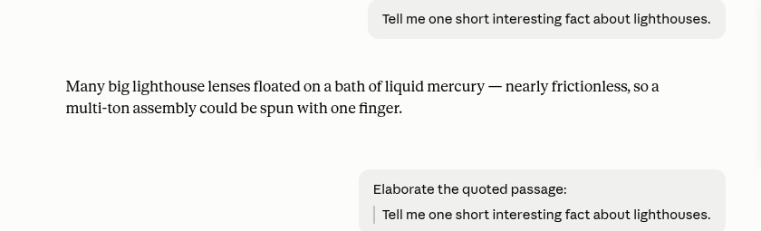
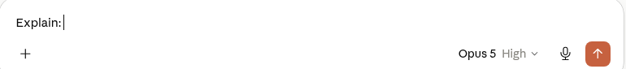
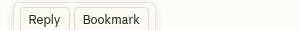
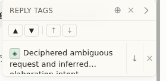

# Claude Composer Toolkit

A Chrome extension for Claude, ChatGPT, Gemini, and Copilot that eliminates cut-and-paste when you're working an AI conversation: one-click reply macros instead of retyping the same request, and a way to find your place again instead of scrolling and re-selecting.

No account, no server, no analytics. Everything it remembers lives in `chrome.storage.local` — your browser, your machine, nowhere else.

## What it does

### Composer macros

Nine buttons above the message box — five intent verbs, then a divider, then four verbosity levels:

| Button | What it does |
| --- | --- |
| **Explain** | Ask for an explanation. |
| **Clarify** | Ask for a clarification. |
| **Elaborate** | Ask for more detail. |
| **Expand** | Ask for a longer treatment of the same thing. |
| **Condense** | Ask for a shorter one. |
| **Very terse / Terse / Normal / Verbose** | Set the persistent verbosity level — see below. |

**The referent rule** is the non-obvious part, and it's the same rule for all five verb buttons: *if you have a page selection, the button acts on that; if you don't, it acts on the assistant's own last reply.* A selection always wins when one exists — you don't need a separate step to "attach" it. Click Elaborate with nothing selected and it elaborates on the last thing the assistant said; select a specific sentence in a long reply first and Elaborate targets only that sentence, quoted, instead:

**Empty vs. non-empty composer** changes what a verb button does, independent of the referent rule above:

- **Composer is empty, no selection** → inserts a label (`Explain: `) and stops. It's a prompt starter, not a send — type your actual question after it.
- **Composer already has text, no selection** → prepends the label and sends immediately. Useful mid-thought: type your question, then click a verb instead of typing the verb yourself.
- **A page selection exists** (either composer state) → quotes the selection and sends immediately, per the referent rule above.

Only the first case waits for you. The other two send right away — there's no confirmation step, since the whole point is one click instead of several.

**Verbosity is a mode, not a one-shot.** Clicking a level doesn't just affect your next message — it's meant to persist for the rest of that conversation, stamping every message you send afterward with a request to match it, until you pick a different level or start a new chat.

> **Known issue:** the stamp currently doesn't reach the sent message on a real button-click send — confirmed via direct testing, not yet fixed. The level button still shows as active and the intent above is correct; the actual stamping mechanism is what's broken. Don't rely on it persisting until this note is removed.

### Reply / bookmark sidebar

Select text in a response to get a small floating toolbar right above it:

- **Reply** — quotes the selection into the composer as your next message's context.
- **Bookmark** — remembers your place without composing anything, so you can jump back to it.

> **Ask aside / Define, and the cross-tab "sidecar" receiver toggle, are currently disabled** pending a redesign of how sending a selection to another open tab should actually work. The underlying send/receive plumbing is still in the code, just not exposed — turning it back on later is a one-line flip, not a rebuild.

The sidebar itself (collapsed to a thin rail by default, click to expand) lists everything you've bookmarked or replied to in the current chat, newest first, and lets you walk through them (▲▼) or step turn-by-turn through the conversation (↑↓) regardless of what's bookmarked:

Bookmarks are anchored by their text, not by DOM position — the host page re-renders turns freely, so a bookmark finds itself again by searching the page for what it remembers saying, not by holding a stale reference.

## Why the verbosity stamp is a bracket token, not a sentence

The persistent verbosity marker looks like `;;verbosity:terse;;`, appended to the end of a stamped message rather than written as an instruction in prose. Two reasons:

1. **It's greppable.** If you keep any kind of log of your own conversations, a fixed token is trivial to search for; a sentence that says the same thing five different ways across five messages isn't.
2. **A model reads a bracket token as metadata about the message, not as part of the request.** Prose instructions compete with whatever else is in the message for the model's attention; an out-of-band marker doesn't.

It's a deliberate convention, not an accident of how the feature got built.

## Install

1. Clone or download this folder.
2. `chrome://extensions` → enable **Developer mode** → **Load unpacked** → select the folder.
3. Open claude.ai. The macro buttons appear above the composer; the bookmark rail appears as a thin strip on the right edge.

Also works, composer macros included, on gemini.google.com, chatgpt.com/chat.openai.com, and Microsoft 365 Copilot (m365.cloud.microsoft). See "Scope" below.

## Scope

Both the composer macros and the sidebar/bookmark/reply/navigation feature work across all four sites — Claude, ChatGPT, Gemini, and Copilot. Each site has its own composer implementation, so a shared site-adapter boundary (`findInput`/`findSubmit`/`SITE`) isolates the per-site quirks: ChatGPT submits via a synthetic Enter keypress rather than a button click, Copilot's Lexical-based editor needs a real click sequence dispatched before it accepts programmatic text insertion, and each site's composer gets anchored to a different DOM landmark since none of them expose the same structure. If a fifth site gets added, that boundary is where its adapter goes.

## What this isn't

No cross-device sync, no cloud bookmark storage, no telemetry, no "sign in to save your bookmarks." Everything is local to the browser profile you installed it in. If you clear extension storage or use a different profile, you start fresh.

Making a bookmark does dispatch a plain DOM `CustomEvent` (`crpb-bookmark`) on the page with no listener attached by default — a documented integration point for anyone who wants another extension to react to it, not a hidden network call. With nothing listening, it's a no-op: nothing leaves the browser.
